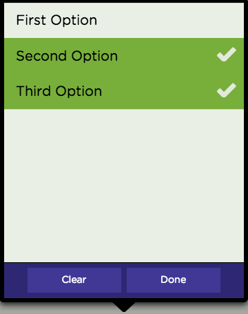

Ux.field.Multiselect
====================

License: MIT

Multiselect field for Sencha Touch 2.1/2.2/2.3 Works as a single or multi select field.

It can easily extend Ext.field.Text if to take the missing code from Ext.field.Select and add it to Ux.field.Multiselect.

usePicker config won't work as it is always used a list on both tablets and phones

Usage
```javascript
Ext.create('Ext.form.Panel', {
    fullscreen: true,
    items: [
        {
            xtype: 'fieldset',
            title: 'Select',
            items: [
                {
                    xtype: 'multiselectfield',
                    label: 'Choose one',
                    delimiter: ',', 
                    mode: 'SINGLE', // default is MULTI,
                    // value: ['first','second'] , init value with an array
                    // value: 'first,second', init value with a string
                    options: [
                        {text: 'First Option',  value: 'first'},
                        {text: 'Second Option', value: 'second'},
                        {text: 'Third Option',  value: 'third'}
                    ]
                }
            ]
        }
    ]
});
```



DEMO: https://fiddle.sencha.com/#fiddle/r9

NOTE: If you extend this component make sure to check this:
https://github.com/vadimpopa/Ux.field.Multiselect/pull/7#issuecomment-115697340
 
